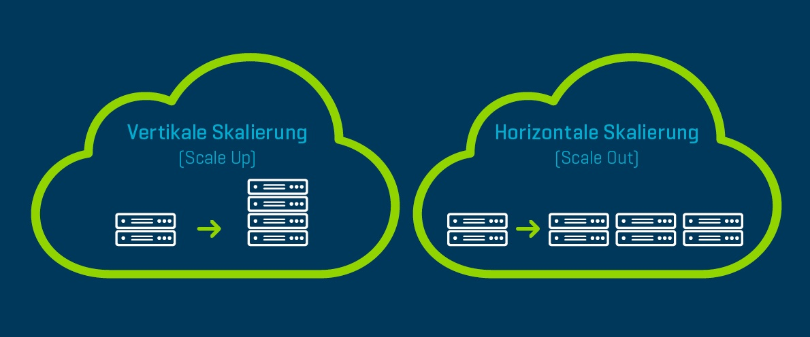

# Lernjournal – LU02b: Vertikale und horizontale Verteilung

## Kurzbeschrieb
Im Theorieblock LU02b behandelten wir die Themen **vertikale und horizontale Verteilung** in verteilten Systemen. Dabei ging es darum, wie Aufgaben und Ressourcen innerhalb eines Systems organisiert und verteilt werden können. Die vertikale Verteilung beschreibt die Aufteilung von Aufgaben auf verschiedene Schichten oder Ebenen (z.B. Präsentations-, Anwendungs- und Datenbankschicht), während die horizontale Verteilung die Vervielfältigung gleicher Komponenten über mehrere Knoten hinweg meint. Wir haben uns angeschaut, wie diese beiden Konzepte in realen Systemen kombiniert eingesetzt werden können. Unser Beispiel war die schweizer Post, ahand welcher wir aufgezeigt haben wie ein verteiltes System funktioniert.

## Lernerfolge
Ich habe durch diesen Block ein besseres Verständnis dafür gewonnen, **wann und warum** man Systeme vertikal oder horizontal verteilt. Besonders wichtig fand ich die Unterscheidung zwischen **horizontaler und vertikaler Skalierung**, die jeweils unterschiedliche Anforderungen und Herausforderungen mit sich bringen. Ich konnte mir durch die Beispiele (z.B. Webshop und SETI@home) gut vorstellen, wie solche Architekturen in der Praxis aussehen. Zusätzlich habe ich gelernt, dass hybride Ansätze oft notwendig sind, um die Vorteile beider Methoden zu kombinieren.

## Lernstrategie
Ich bin beim Lernen so vorgegangen, dass ich die wichtigsten Begriffe und Konzepte während dem Unterricht **stichwortartig notiert** und anschliessend mit eigenen Worten zusammengefasst habe. Das hilft mir, die Inhalte besser aufzunehmen. Das Erarbeiten von Praxisbeispielen hat mir sehr geholfen, die Theorie greifbar zu machen.

## Fazit
Durch diesen Unterrichtsblock habe ich erkannt, wie entscheidend eine gute Systemarchitektur für die **Skalierbarkeit und Stabilität** von Anwendungen ist. Meine Lernstrategie mit eigenen Notizen hat sich als sehr effektiv erwiesen, und ich werde sie auch bei zukünftigen Theorieblöcken weiter anwenden. Für die nächsten Learning Units nehme ich mir vor, zusätzlich noch mehr auf **praktische Beispiele und Anwendungen** zu achten, um die Theorie noch besser mit der Realität verknüpfen zu können.

---

---

## 📘 Glossar


**Vertikale Skalierung**  
Leistungssteigerung eines **einzelnen Systems** durch Aufrüsten der Hardware (z.B. mehr RAM, stärkere CPU). Gut für einfache Verwaltung, aber begrenzt in der Erweiterbarkeit.

**Horizontale Skalierung**  
Erweiterung der Systemleistung durch **Hinzufügen zusätzlicher Instanzen** oder Server. Bietet bessere Skalierbarkeit und Ausfallsicherheit.

**Verteiltes System**  
Ein System, das aus mehreren **miteinander verbundenen, eigenständigen Computern** besteht, die zusammenarbeiten, um eine gemeinsame Aufgabe zu erfüllen.

**Hybrid-Skalierung**  
Kombination aus vertikaler und horizontaler Skalierung, um die Vorteile beider Methoden zu nutzen – häufig in komplexen Systemarchitekturen eingesetzt.

**Loadbalancing**  
Die gleichmässige Verteilung von Traffic auf mehrere Nodes, um Überlastungen zu vermeiden und die Leistung zu optimieren.

**Ausfallsicherheit**  
Fähigkeit eines Systems, **trotz Fehlern oder Ausfällen einzelner Komponenten** weiterhin zuverlässig zu funktionieren. -> Replica Funktion in Docker Stack

# Lernjournal – RESTful Webservices, Flask-RESTful & AJAX


---

##  Kurzbeschrieb
In diesem Unterrichtsblock ging es um die Grundlagen von RESTful Webservices und deren praktische Umsetzung mit dem Python-Framework Flask-RESTful. Zudem wurde AJAX als Technik zur asynchronen Datenübertragung im Browser eingeführt. Ich habe gelernt, wie man eine REST-API erstellt, wie man Anfragen strukturiert und verarbeitet, und wie man mit `fetch()` Daten vom Server laden kann, ohne die Seite neu zu laden.

---

##  Lernerfolge

- Ich verstehe nun, was einen RESTful Webservice ausmacht: Ressourcen, URI, HTTP Methoden (GET, POST, PUT, DELETE) und Statuscodes.
- Ich kann einfache APIs mit Flask-RESTful schreiben und weiss, wie ich Ressourcenklassen implementiere.
```python
class Bug(Resource):
    def get(self):
        if not bugs:
            return {"message": "Keine Bugs gefunden. Dein Code läuft... für jetzt."}, 200
        return {"bugs": bugs}, 200

    def post(self):
        bug_data = request.json
        bug_description = bug_data.get("description", "Unbekannter Bug")
        bugs.append(bug_description)
        return {
            "message": f"Bug gespeichert: '{bug_description}'. Glückwunsch, du hast gerade technische Schulden produziert!",
            "total_bugs": len(bugs)
        }, 201
```
- Ich kenne den Unterschied zwischen Query-Parametern (z.B. in der URL enthalten) und Formular-Parametern (z.B. im Body).
- Ich habe verstanden, wie `fetch()` funktioniert und wie es verwendet wird, um eine Textdatei dynamisch in eine Webseite zu laden.
- Ich kann die Bedeutung von Statuscodes wie `200 OK`, `404 Not Found` oder `500 Internal Server Error` einordnen und anwenden.

---

##  Lernstrategie

Ich habe den Unterricht aufmerksam verfolgt und mir Notizen gemacht. Besonders hilfreich war für mich das Schreiben eines eigenen kleinen Webservices in Flask mit einer `HelloWorld`-Ressource. Ich habe die Beispiele mit eigenen Parametern erweitert, um ein besseres Gefühl für den Datenfluss zu bekommen. Danach habe ich die AJAX-Beispiele Schritt für Schritt nachgebaut und verändert, um deren Funktionsweise zu verstehen. Ich habe auch viel mit Konsolenausgaben und `print()`-Statements gearbeitet, um zu sehen, wann welcher Teil des Codes aktiv ist (und vorallem weil ich den Debugger immer noch nicht wirklich effizient brauchen kann).

---

## Fazit

Durch die praktische Arbeit mit Flask-RESTful und AJAX habe ich ein besseres Verständnis für die Kommunikation zwischen Frontend und Backend bekommen ohne State speichern zu können.

---

---
## Glossar

- **REST**: Ein Architekturstil für Webservices, bei dem Ressourcen über HTTP eindeutig per URI angesprochen werden.
- **URI**: Eine eindeutige Adresse, unter der eine Ressource im Web erreichbar ist (z.B. `/api/user/1`).
- **HTTP-Methoden**: Befehle wie GET, POST, PUT und DELETE, mit denen Clients dem Server mitteilen, was sie tun möchten.
- **Statuscode**: Eine Antwort vom Server, die den Zustand der Anfrage beschreibt – z.B. `200 OK` für erfolgreich oder `404 Not Found` für eine nicht gefundene Ressource. Mein persönlicher Lieblingsstatuscode ist aber `503 Service Unavailable`, weil sich mein Gehirn aktuell genau so fühlt.
- **Query-Parameter**: Daten, die direkt in der URL übergeben werden, z.B. `/search?q=flask`.
- **Formular-Parameter**: Daten, die im Body einer POST-Anfrage übermittelt werden, z.B. bei einem Login-Formular.
- **AJAX**: Eine Technik, mit der Webanwendungen Daten im Hintergrund laden können, ohne die ganze Seite neu zu laden (Asynchroner Request auf ein Node JS Backend).
- **`fetch()`**: Eine moderne JavaScript-Funktion, mit der Daten asynchron vom Server angefordert werden können.
- **JSON**: Die Javascript Objekt Notation.

# Lernjournal LU05a – LU06b: Authentisierung, Autorisierung und Token in Webanwendungen

## Kurzbeschrieb

In diesen Unterrichtsblöcken ging es um die Grundlagen der Authentisierung und Autorisierung in Webanwendungen sowie um moderne Verfahren zur sicheren Identifikation von Benutzern. Dabei wurde insbesondere auf JSON Web Tokens (JWT) eingegangen, die eine zentrale Rolle bei der Realisierung von Sicherheitsmechanismen in verteilten Systemen spielen. Ergänzend wurde erklärt, wie man solche Tokens in Clients speichern und bei Requests verwenden kann.

## Lernerfolge

Ich habe ein fundiertes Verständnis der Unterschiede zwischen **Authentisierung** (Identitätsbehauptung) und **Authentifizierung** (Identitätsprüfung). Besonders spannend war die Unterscheidung der Authentifizierungsarten: z.B. Passwort, SMS-Code und Fingerabdruck.

Die Einführung von **Mehr-Faktor-Authentifizierung** sowie Technologien wie **FIDO2** zeigen, wie wichtig es ist, die Benutzeridentität auf mehrere Arten zu überprüfen – vor allem im Kontext von Webdiensten mit sensiblen Daten.

---

---

Ein besonderes Aha-Erlebnis hatte ich beim Thema **JWT**: Endlich habe ich wirklich verstanden, wie ein stateless Authentifizierungsmechanismus funktioniert. Dass ein Token nach erfolgreichem Login erstellt, signiert und verschlüsselt wird, und dann bei jedem weiteren Request mitgeschickt wird, ist ein simpler aber effizienter Weg die Authentifizierung zu lösen.

## Reflexion

Ich finde es sehr sinnvoll, dass wir in unserer IDPA-Vorabschlussarbeit *Sproutly* genau diese Techniken einsetzen: Wir nutzen JWT und speichern das Token im `sessionStorage`. Das war am Anfang etwas verwirrend, aber durch das Unterrichtsmaterial konnten wir die Konzepte in unsere Applikation erfolgreich einbauen.


## Glossar (in eigenen Worten)

- **Authentisierung**: Ich sage dem System, wer ich bin – z.B. durch Eingabe meines Benutzernamens.
- **Authentifizierung**: Das System prüft, ob ich wirklich die Person bin – z.B. durch Überprüfung des Passworts.
- **Autorisierung**: Das System entscheidet, ob ich etwas tun darf – z.B. ob ich Bücher aus einer Liste abrufen darf.
- **JWT (JSON Web Token)**: Ein kompaktes, verschlüsseltes Token, das Informationen über mich enthält, z.B. meine Rolle oder ID.
- **Session Storage**: Ein Zwischenspeicher im Browser, der Daten nur solange aufbewahrt, wie die Seite offen ist.
- **Mehr-Faktor-Authentifizierung (MFA)**: Ich muss mehrere Dinge beweisen, z.B. Passwort + Code auf dem Handy.
- **FIDO2**: Ein Authentifizierungsverfahren ohne Passwort, das z.B. auf Hardware-Token basiert.
- **Single Sign-On (SSO)**: Einmal anmelden, mehrfach nutzen – aber nur innerhalb eines bestimmten Kontexts (z.B. derselbe Browser).

# Lernjournal LU07a – LU08d: Discovery und Gateway Services

## Kurzbeschrieb

In diesen Lektionen haben wir zwei zentrale Begriffe aus der Welt der verteilten Systeme angeschaut: **Discovery Services** und **Gateway Services**. Beide sind wichtige Bestandteile moderner Architekturen mit Microservices und tragen wesentlich dazu bei, dass solche Systeme **skalierbar**, **zuverlässig** und **flexibel** bleiben.

## Grundlagen Discovery Service

Ein **Discovery Service** sorgt dafür, dass sich verschiedene Services in einem System gegenseitig finden und miteinander kommunizieren können, auch wenn sich ihre IP-Adressen oder Standorte ständig ändern. Das ist vor allem in dynamischen Umgebungen wichtig, wie man sie in der Cloud oft hat.

### Aufgaben eines Discovery Services:

- **Registrierung**: Ein Service meldet sich beim Discovery Service an und gibt an, wo er erreichbar ist (IP, Port etc.).
- **Service-Entdeckung**: Andere Services können beim Discovery Service nachfragen, wo sich ein gewünschter Dienst befindet.
- **Dynamische Updates**: Neue Instanzen können automatisch erkannt werden.
- **Fehlerbehandlung**: Wenn ein Service ausfällt, wird er aus dem Register entfernt.

Ein bekanntes Beispiel dafür ist **Netflix Eureka** – ein Open-Source-Tool zur Verwaltung von Microservices.


## Grundlagen Gateway Service

Ein **Gateway Service** ist der zentrale Einstiegspunkt für die Kommunikation zwischen einem Client (z.B. ein Browser oder eine Mobile App) und den verschiedenen internen Services eines Systems.

### Funktionen eines Gateway Services:

- **Routing und Weiterleitung**: Weiterleitung von Anfragen an den richtigen Service, je nach URL oder Methode.
- **Transformation**: Konvertierung von Daten in ein einheitliches Format, z.B. JSON.
- **Aggregation**: Zusammenfassen von Antworten mehrerer Services zu einer.
- **Authentifizierung und Autorisierung**: Prüfen von Benutzerrechten mittels z.B. JSON Web Tokens.
- **Lastverteilung**: Gleichmässiges Verteilen der Anfragen auf verschiedene Instanzen.
- **Protokollierung und Überwachung**: Logging und Sammeln von Metriken zur Systemüberwachung.


Der Gateway übernimmt auch die Aufgabe, **Anfragen zu formatieren** und **Antworten zusammenzustellen**, damit der Client nur mit einer klaren API sprechen muss.

## Unterschiede zwischen Gateway und Discovery

| Merkmal | Gateway Service | Discovery Service |
|--------|------------------|----------------|
| **Zweck** | Schnittstelle zwischen Clients und Services | Verwaltung der Erreichbarkeit von Services |
| **Hauptaufgabe** | Anfragevermittlung, Sicherheit, Logging | Registrierung & Lokalisierung von Services |
| **Wer spricht mit wem?** | Client → Gateway → Service | Service ↔ Discovery ↔ Service |
| **Beispiel** | API-Gateway für Online-Shop | Netflix Eureka |

### Zusammenfassung
Man kann sagen:
- Der **Gateway Service** ist zuständig für die Kommunikation **von aussen nach innen** (Client → System).
- Der **Discovery Service** sorgt dafür, dass die Services **untereinander** wissen, wo sie sich befinden.

## Lernerfolge

Ich habe verstanden, wie Microservices so miteinander verbunden werden können, dass sie auch in komplexen oder verteilten Systemen zuverlässig funktionieren. Besonders wichtig war für mich das Prinzip der **dynamischen Service-Entdeckung**, bei dem sich neue Dienste automatisch registrieren und auffindbar werden – das spart Zeit und reduziert Konfigurationsaufwand.

Beim **Gateway Service** habe ich gelernt, wie man eingehende Anfragen **bündelt**, **weiterleitet** und **prüft**, das alles an einem zentralen Ort. Dadurch kann man die internen Services sauber kapseln und trotzdem von aussen einfach darauf zugreifen.

Ich weiss jetzt, dass diese beiden Dienste oft **Hand in Hand** arbeiten und zusammen die Grundlage für eine **skalierbare**, **sichere** und **wartbare** Systemarchitektur bilden.

## Lernstrategie

Ich bin so vorgegangen, dass ich zuerst die theoretischen Grundlagen im Unterricht aufgenommen habe. Danach habe ich mir konkrete Beispiele wie **Netflix Eureka** und ein E-Commerce-System angeschaut, um das Ganze besser zu verstehen. Die Visualisierungen und das Aufzeichnen von Abläufen in Skizzen haben mir geholfen, den Überblick zu behalten.

Zusätzlich habe ich weiterführende Artikel gelesen, z.B. von Heise und Datacenter Insider, um ein besseres Bild davon zu bekommen, wie diese Konzepte in der Praxis eingesetzt werden. Dabei habe ich mich auf die Funktionsweise konzentriert, statt auf die konkrete Implementierung in einem bestimmten Framework.


## Glossar

- **Discovery Service**: Vermittler zwischen Services, der Adressen & Verfügbarkeiten verwaltet.
- **Gateway Service**: Zentrale Schnittstelle für Anfragen von Clients.
- **Routing**: Entscheidung, welche Anfrage wohin geht.
- **Netflix Eureka**: Discovery-Service von Netflix, FOSS.

## Bongo Cat Counter
Für dieses Lernjournal wurden 6069 Bongo Cat Taps verwendet, meinem [Bongo Kätzchen](https://store.steampowered.com/app/3419430/Bongo_Cat/) Bluten die Pfötchen.


# Lernjournal – LU09a
## Exploding Kittens: Verteiltes System mit Clowder Service

---

### Kurzbeschrieb
In diesem Unterrichtsblock ging es darum, ein einfaches verteiltes System zu programmieren, das auf dem Spiel *Exploding Kittens* basiert. Dabei kamen sogenannte *Kitten Bots* sowie ein Discovery Service namens **Clowder Service** zum Einsatz.  
Das Hauptthema war die Verbindung und Kommunikation zwischen den Services und dem Clowder Service. Die theoretischen Grundlagen dazu wurden ergänzt und im Praxisbeispiel konkret angewendet.

---

### Lernerfolge
- Ich konnte mein bestehendes Wissen aus der letzten Woche direkt anwenden und darauf aufbauen.
- Das Projekt *Exploding Kittens* läuft als Standalone und wird noch während 5 weiteren Wochen weiterentwickelt.
- Mein grösster Aha-Moment war, dass ich viele Codeteile aus der Vorwoche wiederverwenden konnte – das hat mir viel Zeit gespart.
- Auch wenn es keine grossen neuen Erkenntnisse gab, half mir das schrittweise Rantasten, um Sicherheit im Umgang mit dem Clowder Service zu gewinnen.

---

### ️ Lernstrategie
- Ich habe aktiv auf die **Moodle-Theorien** der letzten Woche zurückgegriffen, was mir beim Verständnis der Zusammenhänge sehr geholfen hat.
- Ergänzend habe ich frühere Artikel und Materialien nochmals konsultiert, um mein Wissen zu festigen.
- Bei einem Problem mit dem Typ `None` bzw. `NoneType` am Anfang habe ich durch Debugging und gezielte Recherchen die Lösung gefunden.

---

###  Fazit
Auch wenn keine neuen Inhalte dazukamen, war dieser Block für mich ein wertvoller Schritt, um Sicherheit mit dem Clowder Service zu gewinnen. Das Wiederverwenden von Code war nicht nur zeitsparend, sondern auch motivierend, da ich gesehen habe, dass mein Vorwissen trägt.  
In den kommenden Wochen werde ich weiterhin auf bewährte Strategien setzen – wie etwa das strukturierte Vorgehen mit Moodle-Inhalten – und mein Projekt systematisch ausbauen.

## Bongo Cat Counter
Für dieses Lernjournal wurden 2942 Bongo Cat Taps verwendet, meinem [Bongo Kätzchen](https://store.steampowered.com/app/3419430/Bongo_Cat/) geht langsam die Kraft aus.


# Lernjournal – Pub/Sub und MQTT

## Kurzbeschrieb
In diesem Unterrichtsblock haben wir das Kommunikationsmodell **Publish/Subscribe (Pub/Sub)** kennengelernt, das insbesondere im Kontext vom **Internet of Things (IoT)** eine zentrale Rolle spielt. Im Fokus standen die Konzepte hinter Pub/Sub, die beteiligten Komponenten (Publisher, Subscriber, Pub/Sub-System) sowie das leichtgewichtige Protokoll **MQTT**, das dieses Modell in der Praxis umsetzt. Ein besonderes Augenmerk lag auf den Vorteilen der Entkopplung, Skalierbarkeit und Zuverlässigkeit solcher Systeme. Anhand eines Hausautomationsbeispiels wurde aufgezeigt, wie solche Systeme in der Realität funktionieren können.

## Lernerfolge
Ich konnte mir einen klaren Überblick über die Funktionsweise von Pub/Sub-Systemen verschaffen. Es wurde mir bewusst, wie wichtig die Entkopplung von Publishern und Subscribern ist, um flexible und skalierbare Systeme zu entwickeln. Besonders spannend fand ich das MQTT-Protokoll, das genau für solche Anforderungen im IoT-Bereich entwickelt wurde. Ich kenne jetzt, was die verschiedenen **QoS-Stufen (Quality of Service)** bedeuten und wie sie sich auf die Nachrichtenzustellung auswirken. Ausserdem wurde mir der Nutzen von Themenstrukturen (z.B. Küche/Kühlschrank/Temperatur) und retained messages klar.

## Lernstrategie
Meine Strategie war, den empfohlenen Artikel von der Website der Firma EMQX aufmerksam zu lesen. Dabei habe ich mir beim Lesen Notizen gemacht, die wichtigsten Begriffe markiert und das Beispiel mit Publisher und Subscriber in Python nachverfolgt. Um das Ganze besser zu verstehen, habe ich versucht, die Erklärungen in eigenen Worten zusammenzufassen. Dabei habe ich insbesondere darauf geachtet, die Begriffe wie „Thema“, „Broker“ oder „QoS“ richtig einzuordnen. Zudem habe ich auf Moodle nochmal die Theorie aus den vorherigen Wochen zu Pub/Sub durchgelesen – das hat mir beim Einordnen des neuen Stoffs sehr geholfen.

## Fazit
Obwohl die Thematik auf den ersten Blick technisch wirkt, ist sie logisch aufgebaut und nachvollziehbar. Die Beispiele und das klare Kommunikationsmodell haben mir geholfen, das Ganze besser zu verstehen. In Zukunft möchte ich MQTT selbst mal ausprobieren und deployen – zum Beispiel in einem kleinen Raspberry-Pi oder ESP32 Webserver zu Hause. Durch das strukturierte Lesen und Zusammenfassen kann ich mir neue Inhalte gut erarbeiten – diese Strategie möchte ich beibehalten.

## Beispiel
Ein einfaches Beispiel eines solchen Pub/Sub Services ist [NTFY](https://ntfy.sh) welchen ich auch selbst als Docker Container verwende und betreibe.

## Glossar

**Pub/Sub (Publish/Subscribe)**  
Ein Kommunikationsmodell, bei dem Nachrichten von Publishern an ein zentrales System gesendet werden und von dort an alle abonnierten Subscriber verteilt werden. Publisher und Subscriber kennen sich nicht direkt.

**Publisher**  
Ein System oder Gerät, das Nachrichten erzeugt und an das Pub/Sub-System sendet.

**Subscriber**  
Ein System oder Gerät, das sich für bestimmte Themen registriert, um passende Nachrichten vom Pub/Sub-System zu empfangen.

**Pub/Sub-System / Broker**  
Die vermittelnde Instanz, die Nachrichten von Publishern entgegennimmt und an alle passenden Subscriber verteilt. In MQTT nennt man diesen Vermittler „Broker“.

**MQTT (Message Queuing Telemetry Transport)**  
Ein leichtgewichtiges Protokoll, das auf dem Pub/Sub-Modell basiert und speziell für Geräte mit wenig Ressourcen (z.B. im IoT-Bereich) entwickelt wurde.

**Thema (Topic)**  
Ein logischer Kanal, über den Nachrichten organisiert und verteilt werden. Topics können hierarchisch strukturiert sein (z.B. `huus/stube/liecht`).

**Nachricht**  
Die Daten, die ein Publisher sendet und ein Subscriber empfängt. Kann z.B. ein Temperaturwert, ein Ereignis oder ein Text sein.

**QoS (Quality of Service)**  
Die Stufe der Zuverlässigkeit bei der Zustellung einer Nachricht. MQTT kennt drei QoS-Stufen:
- **0**: At most once – Nachricht wird einmal gesendet, ohne Bestätigung.
- **1**: At least once – Nachricht wird so lange gesendet, bis sie bestätigt wurde.
- **2**: Exactly once – Nachricht wird genau einmal empfangen, auch bei Verbindungsproblemen.

**Retained Message**  
Eine vom Broker gespeicherte Nachricht, die automatisch an neue Subscriber gesendet wird, sobald sie sich für ein Thema anmelden.

**Entkopplung**  
Das Prinzip, dass Sender und Empfänger von Nachrichten nicht voneinander wissen müssen. Das erhöht die Flexibilität und Wartbarkeit eines Systems.


## Bongo Cat Counter
Für dieses Lernjournal wurden 5485 Bongo Cat Taps verwendet, meine [Bongo Kätzchen](https://store.steampowered.com/app/3419430/Bongo_Cat/) macht mittlerweile Gebrauch vom Streikrecht.

# Lernjournal: Verteilte Datenhaltung und Apache Cassandra

## Kurzbeschrieb
In diesem Unterrichtsblock ging’s um die Grundlagen der verteilten Datenhaltung. Ich hab gelernt, wie man Daten über mehrere Rechner verteilt speichert, um die Last besser zu verteilen und wie man so die Skalierbarkeit erhöht. Wir haben auch gelernt, wie Replikation und Partitionierung funktionieren und welche Techniken dafür verwendet werden. Danach haben wir das Ganze mit einer praktischen Analyse von Apache Cassandra vertieft.

## Lernerfolge
- **Verteilte Datenhaltung**: Ich habe verstanden, wie Daten über mehrere Knoten in einem System verteilt werden können und was Replikation und Partitionierung damit zu tun haben.
- **Skalierbarkeit**: Wir haben herausgefunden, wie man die Skalierbarkeit eines Systems verbessert, indem man die Daten auf mehrere Server aufteilt und Anfragen verteilt.
- **Cassandra**: Ich konnte die wichtigsten Features von Cassandra lernen, wie etwa die Replikation und Partitionierung, und wie es mit grossen Datenmengen umgehen kann.

## Lernstrategie
Ich habe den Artikel durchgelesen, die Konzepte und Beispiele analysiert und mir die wichtigsten Punkte notiert. Besonders bei den praktischen Beispielen habe ich viel Wert darauf gelegt, die Replikations- und Partitionierungsstrategien zu verstehen und mir zu merken, welche Optionen Cassandra da bietet. Danach hab ich die Theorie mit der Analyse von Cassandra verknüpft, um zu sehen, wie die Theorie in der Praxis angewendet wird.

## Fazit
Ich habe viel über die Grundlagen der Datenhaltung gelernt und wie das Ganze bei verteilten Systemen wie Cassandra funktioniert. Das Wissen über Replikation, Partitionierung und Konsistenz wird mir sicher in zukünftigen Projekten helfen, besonders wenn’s um Systeme mit vielen Daten geht. Die Analyse von Cassandra hat mir auch gezeigt, wie man mit grossen Datenmengen und hohen Zugriffszahlen umgehen kann. Wenn ich in Zukunft ein System aufbaue, das solche Anforderungen hat, könnte Cassandra echt eine gute Wahl sein.

---

## 📚 Glossar

**Verteilte Datenhaltung**: Die Speicherung von Daten auf mehreren Knoten oder Rechnern eines Netzwerks, um Skalierbarkeit, Verfügbarkeit und Ausfallsicherheit zu erhöhen.

**Replikation**: Das Anlegen von Kopien derselben Daten auf mehreren Knoten eines Systems, um bei einem Ausfall weiterhin auf die Daten zugreifen zu können.

**Partitionierung**: Die Aufteilung von grossen Datenmengen in kleinere Einheiten, die auf unterschiedlichen Knoten gespeichert werden. Dadurch wird die Last gleichmässiger verteilt.

**ACID**: Ein Konzept aus der klassischen Datenbanktheorie, das für Transaktionen steht, die atomar, konsistent, isoliert und dauerhaft sein müssen.

**BASE**: Ein alternatives Modell zu ACID, das bei verteilten Systemen häufiger eingesetzt wird. Es steht für „Basically Available, Soft State, Eventually Consistent“.

**Eventual Consistency**: Ein Konsistenzmodell, bei dem sichergestellt ist, dass alle Kopien der Daten irgendwann denselben Stand haben – aber nicht notwendigerweise sofort.

**Consistent Hashing**: Ein Verfahren zur Partitionierung von Daten, das besonders gut mit dynamisch wechselnden Knotenanzahlen umgehen kann.

**QUORUM**: Ein Konsistenzlevel bei Cassandra, bei dem eine Mehrheit der Knoten antworten muss, um eine Lese- oder Schreiboperation als erfolgreich zu bewerten.

**Cassandra**: Eine verteilte NoSQL-Datenbank, die für hohe Verfügbarkeit, horizontale Skalierbarkeit und schnelle Verarbeitung grosser Datenmengen entwickelt wurde.

**NoSQL**: Eine Klasse von Datenbanken, die nicht auf relationalen Modellen basiert. Sie sind meist schemalos, horizontal skalierbar und besonders geeignet für grosse, verteilte Systeme.

## Bongo Cat Counter
Für dieses Lernjournal wurden 4632 Bongo Cat Taps verwendet, mein [Bongo Kätzchen](https://store.steampowered.com/app/3419430/Bongo_Cat/) ist vom Streik zurückgekehrt und trommelt fleissig weiter. <br>


# Lernjournal: Überwachung und Logging in verteilten Systemen

## Kurzbeschrieb
Verteilte Systeme erfordern effizientes Monitoring und Logging, um ihre Leistung und Zuverlässigkeit sicherzustellen. Monitoring ermöglicht das Überwachen von Systemmetriken wie Latenz und Fehlern, während Logging dazu dient, Ereignisse und Fehler detailliert zu dokumentieren. Diese Prozesse sind entscheidend, um Probleme frühzeitig zu erkennen und schnell zu beheben, was für den Betrieb großer, verteilter Systeme unverzichtbar ist.

## Lernerfolge
- **Verständnis der Überwachungsmetriken:** Ich habe gelernt, welche Metriken wie Latenz, Verkehr und Fehler für das Monitoring verteilte Systeme relevant sind.
- **Wichtigkeit des Loggings:** Ich habe den Unterschied zwischen zentralisiertem und dezentralisiertem Logging verstanden und wie Logs dabei helfen, Probleme in einem System zu analysieren und zu beheben.
- **Tools kennen gelernt:** Ich bin mit verschiedenen Monitoring- und Logging-Tools vertraut geworden, wie Prometheus, Grafana und dem ELK Stack.

## Lernstrategie
Ich habe dieses Thema durch eine Kombination aus praktischen Übungen und theoretischen Artikeln erarbeitet. Zunächst habe ich mich auf die Grundlagen des Monitorings konzentriert, um die wichtigsten Metriken zu verstehen. Danach habe ich mich mit Logging und dessen Bedeutung für die Fehlerdiagnose auseinandergesetzt. Parallel dazu habe ich mich mit den Tools beschäftigt, indem ich sie in einer lokalen Umgebung eingerichtet habe, um deren Funktionsweise und Anwendung zu verstehen.

## Fazit
Das Monitoring und Logging sind essenziell für die Fehlerprävention und Performance-Optimierung in verteilten Systemen. Durch dieses Lernen habe ich nicht nur ein tiefes Verständnis für die Notwendigkeit dieser Prozesse entwickelt, sondern auch praktische Erfahrungen im Umgang mit gängigen Tools gewonnen. In zukünftigen Projekten werde ich diese Konzepte und Tools anwenden, um die Qualität und Stabilität der Systeme, an denen ich arbeite, zu gewährleisten.


## Tools für Monitoring und Logging
Für das Monitoring und Logging in verteilten Systemen gibt es verschiedene Tools, die eine einfache Erfassung und Analyse ermöglichen.

### Monitoring-Tools:
- **Prometheus:** Ein Open-Source-Tool, das Zeitserien-Daten erfasst und zur Analyse von Systemmetriken genutzt wird.
- **Grafana:** Ein Dashboard-Tool, das mit Prometheus kombiniert werden kann, um Metriken visuell darzustellen.
- **Zabbix:** Ein weiteres Open-Source-Monitoring-Tool für Netzwerke und Server, das Alarme und Berichte generiert.

### Logging-Tools:
- **ELK Stack (Elasticsearch, Logstash, Kibana):** Ein weit verbreitetes Logging-Framework, das Logs verarbeitet und analysiert.
- **Fluentd:** Ein weiteres Open-Source-Log-Aggregationstool, das für die Verarbeitung und Weiterleitung von Logs verwendet wird.

## Zusammenfassung
Das Monitoring und Logging sind fundamentale Bestandteile für die Verwaltung und Optimierung von verteilten Systemen. Sie ermöglichen eine frühzeitige Erkennung von Problemen und die Durchführung gezielter Maßnahmen zur Behebung von Fehlern. Tools wie Prometheus, Grafana und der ELK Stack bieten leistungsstarke Lösungen, um diese Prozesse zu automatisieren und zu vereinfachen.

## Bongo Cat Counter
Für dieses Lernjournal wurden 4820 Bongo Cat Taps verwendet, mein [Bongo Kätzchen](https://store.steampowered.com/app/3419430/Bongo_Cat/) wird jetzt ebenfalls als Service mit Prometheus überwacht. <br>